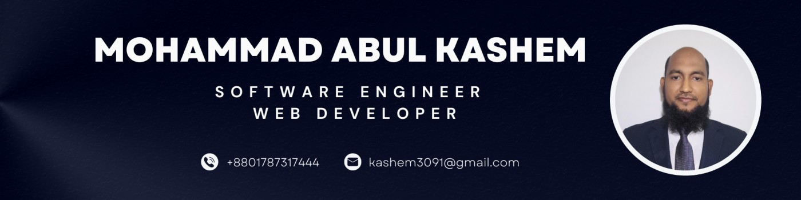

<h1 align="center">Hi there, I'm MOHAMMAD ABUL KASHEM </h1>
<h3 align="center">Software Engineer | Full Stack Web Developer | Learner</h3>
<h6 align="center">

⚡[Linkedin](https://www.linkedin.com/in/mohammad-abul-kashem/)
⚡[LeetCode](https://leetcode.com/engrkashem/)
⚡[Facebook](https://www.facebook.com/ksmbd)

</h6>

## About Me

- I am an **EEE Engineer** with extensive hands-on experience in **web development and software engineering**, specializing in building scalable, high-performance applications. My expertise lies in **backend-focused development**, with strong capabilities in frontend design and integration, ensuring seamless and efficient software solutions.

- I have a proven track record with technologies such as **JavaScript, TypeScript, Python, C++, React.js, Node.js, Django, GraphQL, MySQL, PostgreSQL, MongoDB, and Mongoose**, complemented by a solid foundation in **Data Structures and Algorithms**. My skills enable me to design and implement systems that are not only technically robust but also aligned with business objectives.

- My background extends beyond development. My experience in **procurement, industrial production, and vendor management** equips me with a unique ability to understand operational workflows and deliver solutions that drive business growth. As an employee, I aim to be a catalyst for organizational success by aligning technical solutions with business strategies.

- I am enthusiastic about contributing as a **Software Engineer or Full-Stack Developer** in national, or multinational organizations. I am open to mid level roles with a clear focus on **long-term growth, collaboration, and creating value**. If you are looking for a professional who combines technical expertise with a business-oriented mindset, let’s connect!

### Contact Details:

- Cell: +8801787317444
- WhatsApp: +8801787317444
- Email: kashem3091@gmail.com
- GitHub: [engrkashem](https://github.com/engrkashem)

### Skills:

- **Core:**

  - JavaScript, TypeScript, Python, C++
  - Data Structure and Algorithm
  - Database management system
  - System design and SDLC
  - Familiar with Rust

- **Backend:**

  - Node.js, Express.js
  - Mongoose ORM, Prisma ODM
  - Graphql Apollo Server
  - MySQL, PostgreSQL, MongoDB
  - Web RTC and Socket.io
  - comfortable with DJANGO

- **Frontend:**

  - HTML, CSS, React.js,
  - Tailwind CSS, Bootstrap, Ant Design, Material UI
  - Redux, RTK Query
  - Familiar with Next.js

   
   

### 🥅 2024 Goals:

<li>Advance API design with professional Documentation.</li>
<li>Unit Testing of Node.js server and React.js</li>
<li>Learn Advance React.js and build an industry standard project.</li>
<li>Learn Next.js to advance level.</li>
<li>System Design</li>
<li>Expertise in DB Schema design.</li>
<li>CI/CD pipeline</li>
<li>Learn Docker and containerize project.</li>
<li>Cross 100 Problems solving on LeetCode.</li>

 
 
 

## 📫 GitHub Stats

  

  

  

<!--
**engrkashem/engrkashem** is a ✨ _special_ ✨ repository because its `README.md` (this file) appears on your GitHub profile.

Here are some ideas to get you started:

- 🔭 I’m currently working on ...
- 🌱 I’m currently learning ...
- 👯 I’m looking to collaborate on ...
- 🤔 I’m looking for help with ...
- 💬 Ask me about ...
- 📫 How to reach me: ...
- 😄 Pronouns: ...
- ⚡ Fun fact: ...
-->
